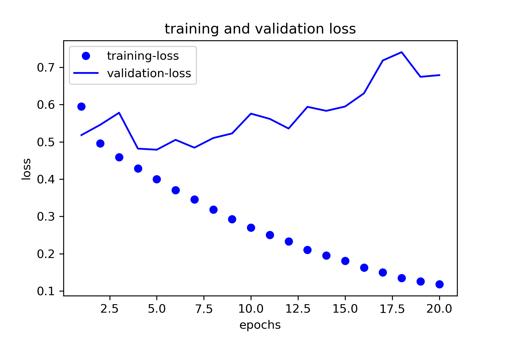
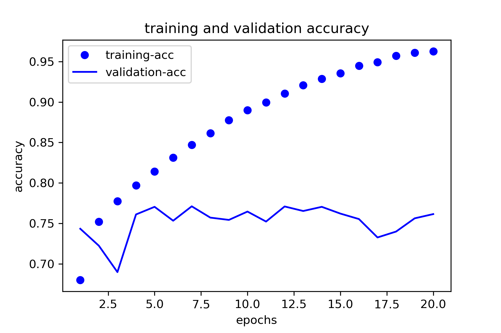

# david-sentiment

## Unsupervised Sentiment Models

> Why *sentiment models from youtube comments?* - Because Twitter text-datasets are overrated, and lack ***sentimentalism***; *The excessive expression of feelings of tenderness, sadness, or nostalgia in behavior, writing, or speech.*

## Todo

- Needed features:
  - Multi-head attention (Transformer model)
  - Encoder/Decoder masking
  - Text generation (RNN)

- Train a custom sentiment model with just a few lines of code - Making it easy to try different configurations or preprocessing techniques.

### Usage

- Create a new project

New tokenizer preprocessing features:

- `enforce_ascii` : Keep only printable chars are added including emojis.
- `remove_urls`   : Remove all urls from the vocab.

```python
from david_sentiment import SentimentConfig

# you can define everything upfront or as you go.
config = SentimentConfig(project_dir="my-model",
                         max_strlen=3000,
                         epochs=10,
                         enforce_ascii=True,
                         remove_urls=True,
                         glove_ndim="100d",)  
```

Build a dataset from database queries:

```python
import david_sentiment.dataset as ds

batch = ds.BatchDB([ds.Fetch('unbox', "%make a video%"),
                    ds.Fetch('v1', "%make a video%"),])
trainable = ds.build_dataset(batch, config, untrainable=False) # default
```

- The `build_dataset()` method works for any iterable of strings.
  - A `trainable` is simply a document annotated by the meta learner (In this case TextBlob).

> At the moment only binary classification datasets are compatible with the full pipeline. But I am planning  to implement multi-categorical features for the same semantic tasks.

```python
from david_sentiment.dataset import YTComments
from david_sentiment.dataset import build_dataset

dataset = YTComments.load_dataset_as_doc() # returns a generator
trainable, untrainable = build_dataset(dataset, config, untrainable=True)
```

- A document goes through a carefully designed pipeline; It is important for you to know what is going on in the background. So if you want to inspect why your documents where `Untrainable` - you can simple ask the method to return it. Here's the output and information after executing the `build_dataset()` method.

```bash
...
⚠ * Found batch with 61478 samples...
Batch: 100%|██████████| 61478/61478 [00:56<00:00, 1086.96/s]

ℹ * Removed 0 items from 61478.
✔ * Returning 61478 samples.
⚠ * Transforming texts to sentences with en_core_web_sm model.
✔ * Done! Successfully preprocessed 210034 sentences.
ℹ * Size before: 61478, and after: 210034.
⚠ * TextBlob annotating texts as binary [0|1] int labels.
✔ * <Annotator> Trainable: ( 88904 ), Untrainable: ( 121130 ).
```

You can train the model with one line - or `step-by-step` **(see below)**

```python
from david_sentiment import SentimentModel

sentiment = SentimentModel(config)
sentiment.train(trainable) # List[Tuple[List[str, int]]]
```

## Working with the model step-by-step (made easy)

The `SentimentModel` class holds all the essential properties of your dataset, like your vocabulary and all common attributes required for building, batching, compiling etc so you can focus on building, training, and experimenting.

- Also, why do we need a class for passing objects around?
  - Instead of passing a bunch of globals all over, you can keep everything in one place. Your workspace stays tidy so you can focus on training and building the model and not managing or trying to locate all those global variables.

- I have a lot of documents?
  - If you have over 5000K samples, I recommend dropping tokens with a frequency of 2 or more (but it depends on your dataset).

```python
# What if you already mande an instance of the SentimentModel class?
# There's no need to pass the config object around! You can simply clone
# the instance cleanly with one step (you can do this as many times you want).
sentiment = SentimentModel.clone(sentiment)

# You can also add existing models and or any models you make later like this:
# this a clean hack to work with the same state and let you experiment with many
# models without running into collisions if you where to use the same instance.
sentiment = SentimentModel.clone(sentiment, model)

# finally, transform the trainable document and its binary labels
# to the format the model expects (segment=True fits the document to 1:1 ratio)
# 1:1 meaning 50% 50% distribution on the [0, 1] binary classes (important!)
x_train, y_train, x_test, y_test = sentiment.transform(trainable,
                                                       segment=True,
                                                       split_ratio=0.2,
                                                       mincount=2)
```

Getting the embedding layer for the model. `[50d, 100d, 200d, 300d]` available.

```python
embedding_layer = sentiment.embedding(l2=1e-6, ndim="200d")
...
✔ '<✔(dim=200, vocab=14108)>'
✔ '*** embedding vocabulary 👻 ***'
✔ 'Glove embeddings loaded from path:'
'/home/<usr>/david_models/glove/glove.6B/glove.6B.200d.txt'
```

```python
model = sentiment.compile_network(None, embedding_layer, return_model=True)
model.summary()
...
Model: "sequential_1"
_________________________________________________________________
Layer (type)                 Output Shape              Param #   
=================================================================
embedding (Embedding)        (None, 166, 200)          2821600   
_________________________________________________________________
flatten_1 (Flatten)          (None, 33200)             0         
_________________________________________________________________
dense_1 (Dense)              (None, 32)                1062432   
_________________________________________________________________
dense_2 (Dense)              (None, 1)                 33        
=================================================================
Total params: 3,884,065
Trainable params: 1,062,465
Non-trainable params: 2,821,600
_________________________________________________________________
```

- And finally train your model!

```python
history = model.fit(x_train, y_train,
                    epochs=20,
                    batch_size=512,
                    validation_data=(x_test, y_test))
...
```

```bash
Train on 45024 samples, validate on 11256 samples
Epoch 1/20
45024/45024 [==============================] - 11s 238us/step - loss: 0.5948 - acc: 0.6801 - val_loss: 0.5180 - val_acc: 0.7433
Epoch 2/20
45024/45024 [==============================] - 10s 214us/step - loss: 0.4958 - acc: 0.7521 - val_loss: 0.5457 - val_acc: 0.7224
...
Epoch 20/20
45024/45024 [==============================] - 11s 239us/step - loss: 0.1185 - acc: 0.9626 - val_loss: 0.6788 - val_acc: 0.7615
```

## Plotting

```python
from david_sentiment.utils import plot_accuracy, plot_losses

plot_losses(history, show=True, save=False)
```



```python
plot_accuracy(history, show=True, save=False)
```



Save the project: Call `save_project()` to create the project directories which saves all the essential settings for initiating a previous state, including; the trained-model and tokenizers vocab files:

- config file         : `<project_name>/config.init`
- trained model       : `<project_name>/model/model.h5`
- tokenizer vocab     : `<project_name>/vocab/vocab.pkl`

```python
ytc_sentiment.save_project()
```

Loading a saved project

```python
from david_sentiment import SentimentConfig, SentimentModel
config = SentimentConfig.load_project('ytc_sentiment/config.ini')
ytc_sentiment = SentimentModel(config)

print(ytc_sentiment)
'<SentimentModel(max_seqlen=62, vocab_shape=(2552, 100))>'
```

## Results

- With punctuation

```python
ytc_sentiment.print_predict("hello, world! i am glad this demo worked! :)")
  "input: hello, world! i am glad this demo worked! :) < pos(😍) (98.3824)% >"
```

- Without punctuation

```python
ytc_sentiment.print_predict("hello world I am glad this demo worked")
  "input: hello world I am glad this demo worked < pos(😀) (91.5674)% >"
```

**Textblob** vs ***SentimentModel*** trained on `1132` samples and `100` epochs.

```markdown
💬 (Textblob=0.0, SentimentModel=99.8896)
  😍 - pewdiepie plz u subcribe me and make a video on me

💬 (Textblob=0.0, SentimentModel=91.9985)
  😀 - You should make a video of you playing PUBG on this phone.

💬 (Textblob=0.0, SentimentModel=48.4672)
  😶 - If it's supposed to be an april fools

💬 (Textblob=0.0, SentimentModel=95.139)
  🤗 - Would you please make a video on Funcl W1 and Funcl AI earphones.

💬 (Textblob=0.0, SentimentModel=78.5567)
  😁 - Will you make a video on it ?

💬 (Textblob=0.0, SentimentModel=98.7835)
  😍 - Please think about it and make a video if you can.

💬 (Textblob=0.0, SentimentModel=94.1769)
  🤗 - we could hope to see in 2020??

💬 (Textblob=0.0, SentimentModel=98.7844)
  😍 - Make a video about not a smartphone plzzzzzzz

💬 (Textblob=0.0, SentimentModel=47.5426)
  😶 - Think about that.

💬 (Textblob=0.0, SentimentModel=98.4927)
  😍 - can you make a video on how to make thumbnail.

💬 (Textblob=0.0, SentimentModel=1.5344)
  🤬 - Please make a video about the vivo nex 2! 🙏

💬 (Textblob=0.0, SentimentModel=89.943)
  😀 - Your biggest fan

💬 (Textblob=0.0, SentimentModel=97.6116)
  😍 - Please make a video on how to use Facebook without internet.

💬 (Textblob=0.0, SentimentModel=61.0681)
  😑 - A BIG DEAL

💬 (Textblob=0.0, SentimentModel=91.3205)
  😀 - but I use my phone a lot for work and Netflix

💬 (Textblob=0.0, SentimentModel=40.8797)
  😒 - so why stop.

💬 (Textblob=0.0, SentimentModel=97.6973)
  😍 - Health, wealth and mind.

💬 (Textblob=0.0, SentimentModel=55.4884)
  😑 - Dose

💬 (Textblob=0.0, SentimentModel=42.6375)
  😒 - I would like to know your opinion.

💬 (Textblob=0.0, SentimentModel=26.5492)
  😤 - Liza don’t believe those hater lovers are here for you
```
